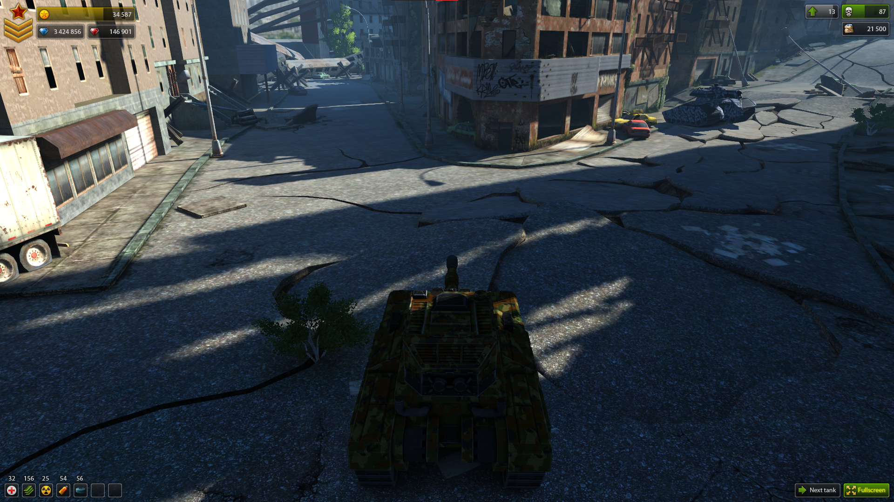

# Tanki Online 2.0
Source code repository for the latest build of the Tanki 2.0 demo, decompiled and deobfuscated.

## Info and history
See the [wiki page](https://github.com/MapMakersAndProgrammers/TankiOnline2.0DemoClient/wiki) for more detailed information and history about Tanki 2.0.

## Download
The latest version can be downloaded from the [releases page](https://github.com/MapMakersAndProgrammers/TankiOnline2.0DemoClient/releases).
### Original
If you want the original or older versions made by AlternativaPlatform they can be found in our [Alternativa demo archive](https://github.com/MapMakersAndProgrammers/alternativa-demos/tree/master/alternativa/Tanki2.0). You can also play them from the Flashpoint Archive ([database entry](https://flashpointproject.github.io/flashpoint-database/search/#56237b92-f141-4e6e-a521-7bb00c905b3c), ID: `56237b92-f141-4e6e-a521-7bb00c905b3c`).

## Controls
### Tank
| Action        | Key bind   |
|---------------|------------|
| Move          | arrow keys |
| Rotate turret | `Z`, `X`   |
| Shoot         | `space`    |
| Next tank     | `enter`    |
### Camera
| Action                                           | Key bind               |
|--------------------------------------------------|------------------------|
| Change camera vertical angle                     | `page up`, `page down` |
| Cycle camera mode (fixed, freecam, orbit)        | `\`, `M`               |
| Cycle freecam mode (view locked to tank, normal) | `N`                    |
| Freecam move                                     | `W`, `A`, `S`, `D`     |
| Freecam look                                     | click and drag         |
| Freecam fly up, down                             | `E`, `C`               |
| Freecam sprint                                   | `shift`                |
| Orbit look                                       | click and drag         |
### Misc
| Action                                        | Key bind            |
|-----------------------------------------------|---------------------|
| Toggle performance statistics                 | `G`                 |
| Toggle antialiasing                           | `Q`                 |
| Toggle console*                               | `ctrl`+`shift`+`K`  |
| Close console                                 | `escape`            |
| Show "powered by AlternativaPlatform" message | `ctrl`+`shift`+`f1` |

*\* See [the wiki](https://github.com/MapMakersAndProgrammers/TankiOnline2.0DemoClient/wiki) for console commands*

## Build from source
This repository uses the vscode [as3mxml](https://github.com/BowlerHatLLC/vscode-as3mxml) extension with the [Adobe AIR SDK](https://airsdk.harman.com/download) 51 from HARMAN, however the project should be able to build and run with any sdk that can target atleast flashplayer 11.

To build just run one of the actionscript build tasks from vscode, such as `compile release` or `compile debug`, which will output the game into the `bin/` folder. To run your built client you will need to download the game `data/` folder and `cfg.dxt1.xml` file from the latest Arena or Crash demos (v3) and place them next to `tanki2.swf`, you can find these files [here](https://github.com/MapMakersAndProgrammers/alternativa-demos/tree/master/alternativa/Tanki2.0).

To package the application you'll need a certificate file (project assumes `./certificate.p12`) and game resources (project assume `data/`, `cfg.dxt1.xml` in `./resources`).
